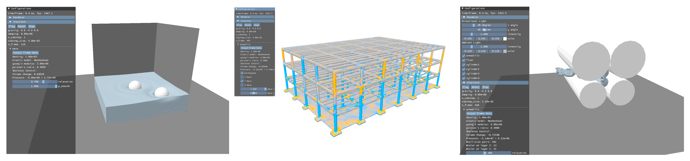

# MiNNIE: a Mixed Multigrid Method for Real-time Simulation of Nonlinear Near-Incompressible Elastics (SIGGRAPH Asia 2024 Journal Track)



## Requirements

* [xmake](https://xmake.io/#/): a cross-platform build utility based on Lua, more elegent than CMake. It directly handles the following dependencies:
  * glfw
  * spdlog
  * eigen
  * tinyobjloader
  * yaml-cpp
  * thrust
* [Vulkan SDK](https://vulkan.lunarg.com/sdk/home): You should manually install Vulkan, and xmake can automatically import it if the environment variable is set correctly. One can try other ways to import this library by modifying `xmake.lua`.
* [CUDA](https://developer.nvidia.com/cuda-toolkit): including `cusparse`, `cusolver`, `cublas`, CUDA version >= 12.0

## To Build

```
xmake
./compile_shader.sh
```

## To Run

```
cd bin
MultiGridSim -c ../configs/xxx.yaml
```

## Note

* Uncommenting the macro `REAL_AS_DOUBLE` in `src/common/mathtype.h` switches to 64-bit float mode
* some scripts require modifying the source code, please refer to the comments in `configs/xxx.yaml`